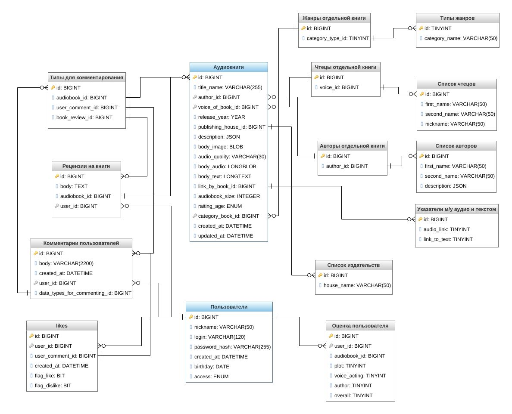
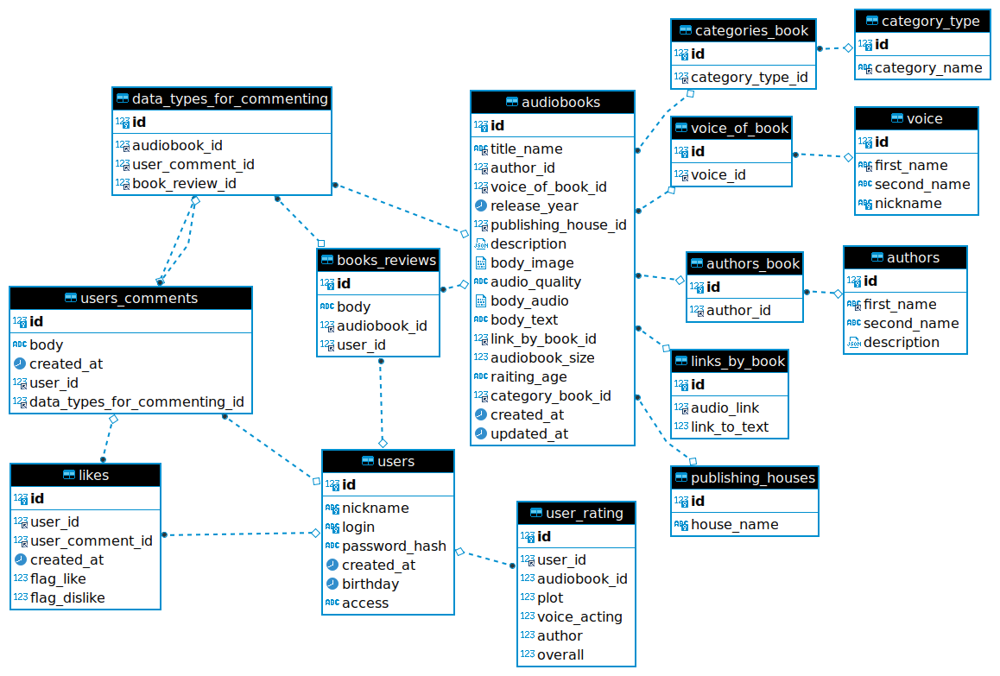

# База данных сервиса прослушивания аудиокниг
| author | год|version|
| -------|----|------:|
| Ok_kir |2021| 0.0.14|
***

Данная БД реализована в рамках проекта по курсу MySQL. 
#### Требования к курсовому проекту:
- [x] Составить общее текстовое описание БД и решаемых ею задач;
- [x] Минимальное количество таблиц — 10;
- [x] Скрипты создания структуры БД (с первичными ключами, индексами, внешними ключами);
- [x] Создать ERDiagram для БД;
- [ ] Скрипты наполнения БД данными;
- [ ] Скрипты характерных выборок (включающие группировки, JOIN'ы, вложенные таблицы);
- [ ] Представления (минимум 2);
- [ ] Хранимые процедуры / триггеры;
***

#### Примечания к работе над проектом
Для формирования проекта БД с возможностью дальнейшего расширения составил план работ:
- Формирование идеи (зачем эта БД вообще нужна);
- Выделение групп пользователей (кто БД будет использовать);
- Выделение связей и сущностей (какие основные объекты можно выделить);
- Выделение основных запросов для БД (какие запросы и кто будут производиться при работе с БД);
- Рисовка диаграммы отношений рисовка типа связей (рисование кто кому что предоставляет и отношения одной таблицы к другой);
- Нормализация реляционных отношений (есть ли в БД избыточное повторение или проблемы при обновлении какой-либо сущности);
- Определение требований к операционной обстановке (на каком оборудовании будет работать данная БД, можно ли оптимизировать поля таблиц по памяти и какой поток обращений к БД предполагается);
- Распределение групп пользователей и прав доступа (будут ли пользователи БД иметь различия между собой);
- Создание таблиц (непосредственно создание SQL скрипта создания БД и заданием всех отношений);
- Проектирование наиболее востребованных запросов (какие сложные запросы будут у пользователей БД и как их оптимизировать);
- Заполнение большой выборкой и тестирование БД.

`Так как ранее не работал с БД план, вероятнее всего, далеко не лучший - жду предложений.`
***
## Системный анализ и словесное описание информационных объектов
#### Название
>База данных сервиса прослушивания аудиокниг.

#### Назначение
>База данных предназначена для предоставления бесплатного сервиса прослушивания, хранения, чтения и выборки
аудиокниг (т.е. библиотека для прослушивания книг). 
>В ней должен быть реализован следующий функционал:
> - возможность выборки книг по автору, чтецу, жанру, издательству оценкам и новизне;
> - возможность перехода из режима аудио к текстовому формату (при помощи указателей на главы);
> - несколько групп пользователей (администратор, модератор, зарегистрированный пользователь,
    незарегистрированный пользователь);
> - возможность пользователя писать рецензии, делать оценку (автора, книгу, чтеца),
    комментировать (книгу, рецензию, другой комментарий);
> - возможность ставить "like" и "dislike" на комментарий `(специально не делаю возможность такой
    оценки на книги, авторов и чтецов)`;
> - на ауадиокнигах должен быть предусмотрен возрастной ценз `(для дальнейшего сервиса похожего на
    "родительский контроль")`;
> - возможность (зарегистрированным пользователям) скачивать аудиокниги `(в дальнейшем можно
    добавить возможность добавлять, но с обязательной проверкой на правообладания)`;
> - возможность видеть усреднённую оценку всех пользователей и формирование рейтинга книг.

#### Основные сущности
> - Аудиокнига:
> - Автор;
> - Чтец;
> - Категория (жанр книги);
> - Пользователь;
> - Издательство;
> - Рецензия;
> - Комментарий;
> - Лайк;
> - Хэш оглавление между текстом и аудио;
> - Выставляемые пользователем оценки.

## Логическое проектирование
### Концептуальная схема БД
Примечание — Соотношения, пока, проиллюстрированы неточно `(TODO нужно
найти нормальный рисовщик ER схем)`.

## Физическое проектирование БД
[Файл создания схемы БД.](database_audiobooks.sql "DDL-команды")

#### ER-модель (DBeaver)

#### Взаимодействие между сущностями при удалении и обновлении (ссылочная целостность) 
1. При удалении / обновлении типа категории (category_type):
    - категории книги (categories_book) обновляются NULL / обновляются.
2. При удалении / обновлении чтеца (voice):
   - чтец книги (voice_of_book) обновляется NULL / обновляются.
3. При удалении / обновлении категории книги (categories_book):
   - аудиокнига (audiobooks) обновляется NULL / обновляется.
4. При удалении / обновлении чтеца книги (voice_of_book):
   - аудиокнига (audiobooks) обновляется NULL / обновляется.
5. При удалении / обновлении авторов книги (authors_book):
   - аудиокнига (audiobooks) обновляется NULL / обновляется.
6. При удалении / обновлении указатели по книги (links_by_book):
   - аудиокнига (audiobooks) возникает ошибка / обновляется.
7. При удалении / обновлении издательства (publishing_houses):
   - аудиокнига (audiobooks) обновляется NULL / обновляется.
8. При удалении / обновлении аудиокниги (audiobooks):
   - строка типа для комментирования (data_types_for_commenting) удаляется / обновляется
   - рецензия на книгу (books_reviews) удаляется / обновляется.
9. При удалении / обновлении пользователя (users):
   - рецензия на книгу (books_reviews) обновляется NULL / обновляется;
   - оценка пользователя (user_rating) обновляется NULL / обновляется;
   - комментарии пользователя (users_comments) остаётся старое значение / обновляется;
   - лайки (likes) удаляются / обновляются.
10. При удалении / обновлении комментарии пользователя (users_comments):
   - строка типа для комментирования (data_types_for_commenting) удаляется / обновляется.

***
P.S. Надеюсь на критику и предложения.
P.P.S. Догадываюсь что БД пока не оптимальная, - именно поэтому собираю замечания и предложения.  
