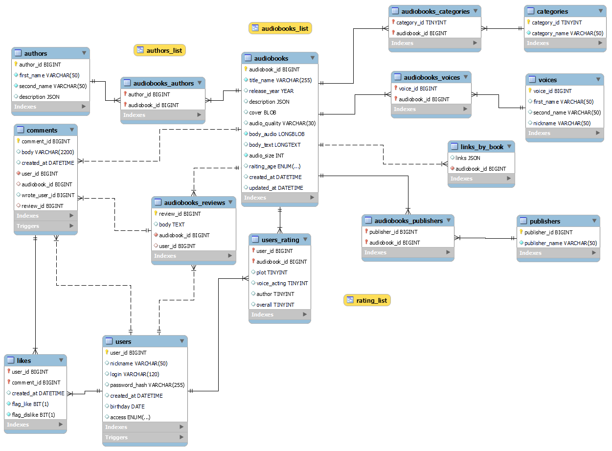

# База данных сервиса прослушивания аудиокниг
| author | год|version|
| -------|----|------:|
| Ok_kir |2021| 0.1.0|
***
## Описание БД реализованной в рамках проекта
База данных "talking_book" является БД для бесплатного сервиса прослушивания аудиокниг.
БД решает задачи:
- поиска нужной пользователю аудиокниги (по заданным критериям);
- быстрый переход из режима аудиокниги к текстовому представлению данной книги;
- учёт пользователей сервиса прослушивания;
- учёт рецензий, комментариев и оценок пользователей;
- поиск информации о пользователе (по заданным критериям);
- учёт `реакций` пользователя (likes и dislikes).
***
### Примечания по структуре БД
1. По пользователям предполагалось 4 типа: администратор, модератор,
   зарегистрированный пользователь и `гость`.
2. Предполагается введение на сервисе прослушивания "родительского контроля".
3. Предполагается возможность скачивания с сервиса файлов аудиокниг.
***
### Примечания по SQL скриптам
1. Не использую SERIAL в DDL специально, - явное лучше неявного (кроме того
это повысит переносимость кода);    
2. Решил не плодить `сущности` с отдельными таблицами под файлы.
***0

### ERD

***

